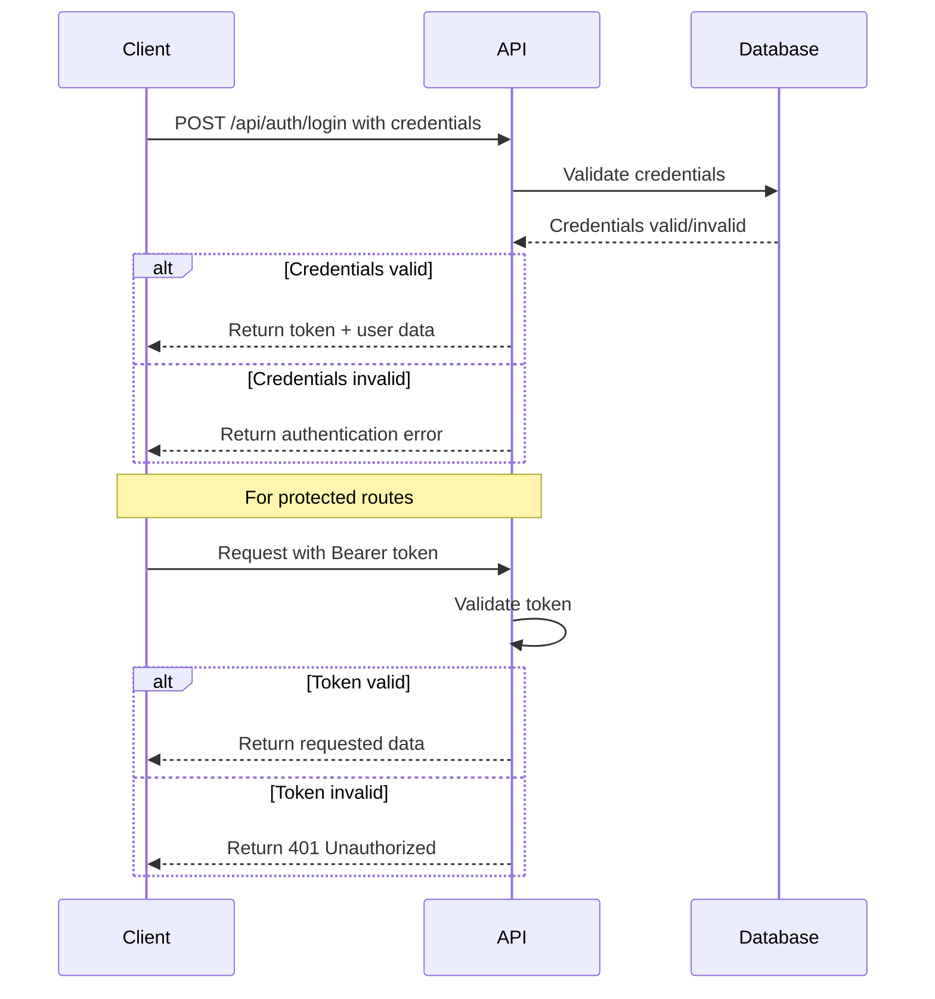
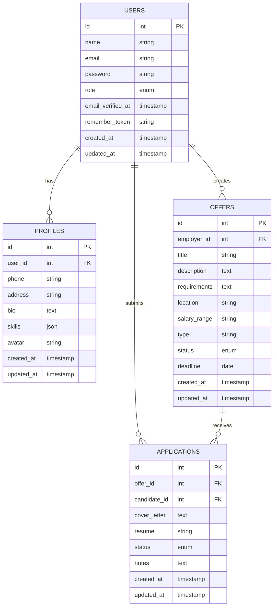

# 🚀 Candidate Management API


<p align="center">
              
</p>

## 📋 Table of Contents

- [Overview](#-overview)
- [Features](#-features)
- [Tech Stack](#-tech-stack)
- [Authentication](#-authentication)
- [API Endpoints](#-api-endpoints)
- [Installation](#-installation)
- [Configuration](#-configuration)
- [Database Structure](#-database-structure)
- [Common Workflows](#-common-workflows)
- [Error Handling](#-error-handling)
- [Deployment](#-deployment)
- [Contributing](#-contributing)
- [License](#-license)

## 🔍 Overview

The Candidate Management API is a robust RESTful service designed to streamline the recruitment process. It provides powerful tools for employers to manage job listings and for candidates to apply and track their applications.

## ✨ Features

- 🔐 Secure authentication with Laravel Sanctum
- 👥 User role management (Admin/Employer/Candidate)
- 📝 Complete job posting lifecycle management
- 📊 Advanced search and filtering capabilities
- 📈 Application tracking and status updates
- 🔔 Notification system for application updates
- 📁 Document handling for resumes and portfolios
- 📱 Mobile-friendly RESTful endpoints

## 🛠 Tech Stack

- **Framework:** Laravel 10.x
- **Authentication:** Laravel Sanctum
- **Database:** MySQL
- **Documentation:** OpenAPI/Swagger
- **Testing:** PHPUnit

## 🔐 Authentication

The API implements token-based authentication using Laravel Sanctum.

<details>
<summary>Authentication Flow</summary>



</details>

### Authentication Endpoints

| Method | Endpoint | Description |
|--------|----------|-------------|
| `POST` | `/api/auth/register` | Register a new user |
| `POST` | `/api/auth/login` | Login and get access token |
| `GET` | `/api/auth/user` | Get authenticated user details |
| `POST` | `/api/auth/logout` | Logout and invalidate token |

#### Example Authentication Request

```bash
# Register a new user
curl -X POST \
              http://localhost:8000/api/auth/register \
              -H 'Content-Type: application/json' \
              -d '{
                            "name": "Jane Doe",
                            "email": "jane@example.com",
                            "password": "securePassword123",
                            "password_confirmation": "securePassword123",
                            "role": "candidate"
              }'
```

#### Example Authentication Response

```json
{
              "status": "success",
              "message": "User registered successfully",
              "data": {
                            "token": "2|eMeNs0jxgkLlsUovyDgT1XXANE1USDfLEgDM4pl7fcb",
                            "user": {
                                          "id": 1,
                                          "name": "Jane Doe",
                                          "email": "jane@example.com",
                                          "role": "candidate",
                                          "created_at": "2023-07-15T09:24:17.000000Z"
                            }
              }
}
```

## 📚 API Endpoints

### User Profiles

| Method | Endpoint | Description | Auth Required |
|--------|----------|-------------|--------------|
| `GET` | `/api/profile` | Get user profile | Yes |
| `PUT` | `/api/profile` | Update user profile | Yes |
| `POST` | `/api/profile/avatar` | Upload profile avatar | Yes |
| `GET` | `/api/profile/{user}` | Get public profile of a user | No |

### Job Offers

| Method | Endpoint | Description | Auth Required |
|--------|----------|-------------|--------------|
| `GET` | `/api/offers` | List all job offers | No |
| `POST` | `/api/offers` | Create a new job offer | Yes (Employer) |
| `GET` | `/api/offers/{offer}` | Get job offer details | No |
| `PUT` | `/api/offers/{offer}` | Update a job offer | Yes (Owner) |
| `DELETE` | `/api/offers/{offer}` | Delete a job offer | Yes (Owner) |
| `GET` | `/api/offers/search` | Search job offers | No |

### Applications

| Method | Endpoint | Description | Auth Required |
|--------|----------|-------------|--------------|
| `GET` | `/api/applications` | List user's applications | Yes |
| `POST` | `/api/offers/{offer}/apply` | Apply for a job | Yes (Candidate) |
| `GET` | `/api/applications/{application}` | Get application details | Yes (Owner/Employer) |
| `PUT` | `/api/applications/{application}` | Update application | Yes (Owner/Employer) |
| `DELETE` | `/api/applications/{application}` | Withdraw application | Yes (Owner) |

<details>
<summary>Example: Create a Job Offer</summary>

#### Request

```bash
curl -X POST \
              http://localhost:8000/api/offers \
              -H 'Authorization: Bearer YOUR_TOKEN_HERE' \
              -H 'Content-Type: application/json' \
              -d '{
                            "title": "Senior Laravel Developer",
                            "description": "We are looking for a skilled Laravel developer...",
                            "requirements": "5+ years of experience with PHP/Laravel...",
                            "location": "Remote",
                            "salary_range": "$80,000 - $100,000",
                            "type": "Full-time",
                            "deadline": "2023-12-31"
              }'
```

#### Response

```json
{
              "status": "success",
              "message": "Job offer created successfully",
              "data": {
                            "id": 1,
                            "title": "Senior Laravel Developer",
                            "description": "We are looking for a skilled Laravel developer...",
                            "requirements": "5+ years of experience with PHP/Laravel...",
                            "location": "Remote",
                            "salary_range": "$80,000 - $100,000",
                            "type": "Full-time",
                            "deadline": "2023-12-31",
                            "created_at": "2023-07-15T10:30:21.000000Z",
                            "updated_at": "2023-07-15T10:30:21.000000Z",
                            "employer": {
                                          "id": 2,
                                          "name": "Acme Inc.",
                                          "profile_image": "https://example.com/profiles/acme.jpg"
                            }
              }
}
```
</details>

<details>
<summary>Example: Apply for a Job</summary>

#### Request

```bash
curl -X POST \
              http://localhost:8000/api/offers/1/apply \
              -H 'Authorization: Bearer YOUR_TOKEN_HERE' \
              -H 'Content-Type: application/json' \
              -F 'cover_letter=I am very interested in this position...' \
              -F 'resume=@/path/to/resume.pdf'
```

#### Response

```json
{
              "status": "success",
              "message": "Application submitted successfully",
              "data": {
                            "id": 1,
                            "offer_id": 1,
                            "status": "pending",
                            "cover_letter": "I am very interested in this position...",
                            "resume_url": "resumes/candidate1_resume_20230715.pdf",
                            "created_at": "2023-07-15T11:05:44.000000Z"
              }
}
```
</details>

## 💻 Installation

```bash
# Clone the repository
git clone https://github.com/yourusername/candidate-management-api.git

# Navigate to the project directory
cd candidate-management-api

# Install dependencies
composer install

# Copy the .env example file
cp .env.example .env

# Generate application key
php artisan key:generate

# Run migrations and seeders
php artisan migrate --seed

# Link storage for file uploads
php artisan storage:link

# Start the development server
php artisan serve
```

## ⚙️ Configuration

Edit your `.env` file to configure:

```env
# Application settings
APP_NAME="Candidate Management API"
APP_ENV=local
APP_DEBUG=true
APP_URL=http://localhost:8000

# Database settings
DB_CONNECTION=mysql
DB_HOST=127.0.0.1
DB_PORT=3306
DB_DATABASE=candidate_management
DB_USERNAME=root
DB_PASSWORD=

# File storage settings
FILESYSTEM_DISK=public

# Mail settings for notifications
MAIL_MAILER=smtp
MAIL_HOST=smtp.mailtrap.io
MAIL_PORT=2525
MAIL_USERNAME=null
MAIL_PASSWORD=null
MAIL_ENCRYPTION=null
MAIL_FROM_ADDRESS=noreply@example.com
MAIL_FROM_NAME="${APP_NAME}"
```

## 📂 Database Structure

<details>
<summary>Database Schema (ERD)</summary>



</details>

## 🔄 Common Workflows

### Employer Workflow

1. Register/Login as an employer
2. Create a job offer with all required details
3. Review incoming applications
4. Update application statuses (pending, shortlisted, rejected, etc.)
5. Contact candidates through the platform

### Candidate Workflow

1. Register/Login as a candidate
2. Update profile with skills, experience, and upload a default resume
3. Browse and search job offers
4. Apply to offers with customized cover letter and resume
5. Track application status
6. Receive notifications on application updates

## ❌ Error Handling

The API returns standardized error responses across all endpoints:

```json
{
              "status": "error",
              "message": "Brief error description",
              "errors": {
                            "field_name": [
                                          "Detailed error message"
                            ]
              }
}
```

### Common HTTP Status Codes

| Code | Description |
|------|-------------|
| 200 | Success |
| 201 | Created |
| 400 | Bad Request (invalid input) |
| 401 | Unauthorized (authentication required) |
| 403 | Forbidden (insufficient permissions) |
| 404 | Not Found |
| 422 | Validation Error |
| 500 | Server Error |

## 🚀 Deployment

### Prerequisites
- PHP 8.1+
- Composer
- MySQL 5.7+
- Web server (Nginx/Apache)

### Deployment Steps

1. Set up your web server with the proper PHP version
2. Configure your web server to point to the `/public` directory
3. Update the `.env` file with production settings:
               ```env
               APP_ENV=production
               APP_DEBUG=false
               ```
4. Generate a new application key:
               ```bash
               php artisan key:generate
               ```
5. Run migrations:
               ```bash
               php artisan migrate --force
               ```
6. Optimize the application:
               ```bash
               php artisan config:cache
               php artisan route:cache
               php artisan view:cache
               ```
7. Set up a task scheduler for recurring jobs:
               ```bash
               * * * * * cd /path-to-your-project && php artisan schedule:run >> /dev/null 2>&1
               ```

## 👥 Contributing

Contributions are welcome! Please feel free to submit a Pull Request.

## 📄 License

This project is licensed under the MIT License - see the LICENSE file for details.

---

<p align="center">
              Made with ❤️ by Your Company
</p>